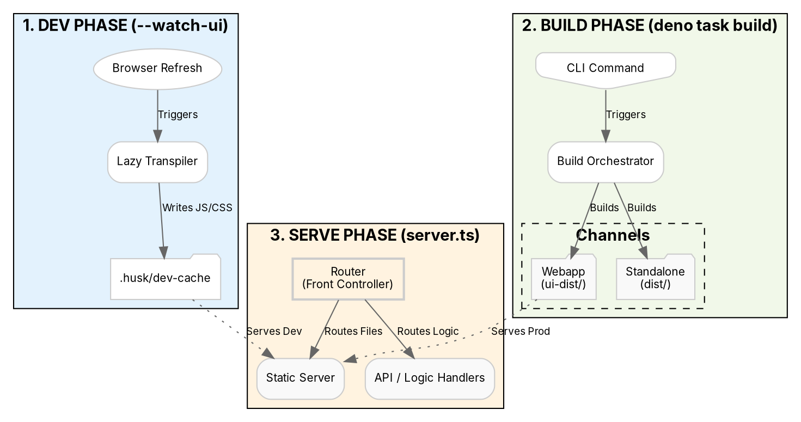

# Husk

A modern Deno framework designed for three distinct operational phases: **Dev**, **Build**, and **Serve**.

## Framework Architecture

The architecture is partitioned into three specialized engines, each optimized for a specific part of the development lifecycle.

### The Three Phases of Husk



## Phase Breakdown

| Phase | Purpose | Output |
| :--- | :--- | :--- |
| **Dev** | Instant developer feedback with zero overhead. | Hidden `.husk/` cache. |
| **Build** | Generating production-ready artifacts for all channels. | `ui-dist/`, `dist/`. |
| **Serve** | High-performance routing and asset delivery. | Live HTTP Responses. |

## Features

-   **Phase Isolation**: Development artifacts never clutter your production folders.
-   **Multi-Channel Build**: One command builds your Webapp, Standalone HTML, and extensions.
-   **On-Demand Dev**: Transpilation only happens when the browser asks for it.
-   **Native Deno 2**: Built on JSR and native Deno standards.

## Usage

### Smart UI Discovery
```typescript
const uiDir = await router.initUI(); 
// In dev: returns .husk/dev-cache
// In prod: returns ui-dist
router.push("/:path*", \`${uiDir}/:path\`);
```

## Husk Utilities

### Logic-Graph (`husk/utils/logic-graph.ts`)
A minimalist static analysis tool that generates behavioral dependency graphs. It maps service-to-service method calls and PubSub event flows (`Publisher -> Topic -> Subscriber`) without the overhead of a full AST parser.

**Usage:**
```bash
deno run -A husk/utils/logic-graph.ts --in=src --out=reports/logic-graph.dot
```

### Imports-Graph (`husk/utils/imports-graph.ts`)
Generates a file-level dependency graph based on ESM imports.
